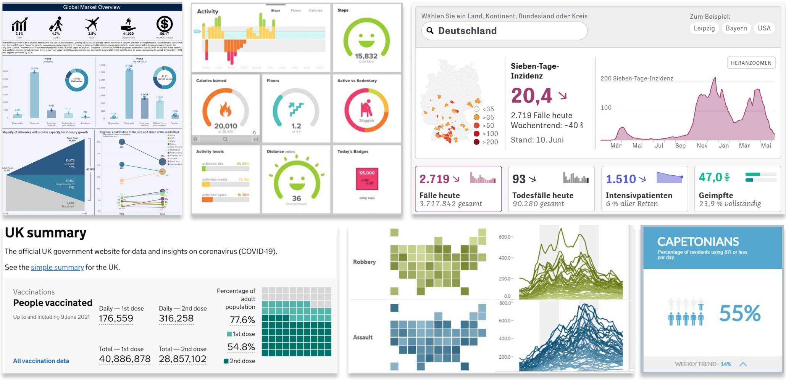

# Dashboard Design Patterns

This page lists **[design patterns for dashboard design](patterns.md)** collected to support the design and creative exploration of dashboard design. We run a dedicated **[workshop](workshop.md)** in March 2022 to help you applying and discussing design patterns in your work.

## What are Dashboards?
Dashboards offer a curated lens through which people view large
and complex data sets at a glance. They combine visual
representations and other graphical embellishments to provide layers
of abstraction and simplification for numerous related data points,
so that dashboard viewers get an overview of the most important or
relevant information, in a time efficient way. Their ability to provide
insight at a glance has led to dashboards being widely used across
many application domains, such as business, nursing and
hospitals, public health, learning analytics, urban analytics, personal analytics, energy and more. 

## Why Design Patterns?

**[>> Download Pattern Cheatsheet (compact version)](https://github.com/dashboarddesignpatterns/dashboarddesignpatterns.github.io/raw/main/docs/assets/Cheatsheet-compact.png)**

**[>> Download Pattern Cheatsheet (slim version)](https://github.com/dashboarddesignpatterns/dashboarddesignpatterns.github.io/raw/main/docs/assets/Cheatsheet-vertical.png)**

There are many high-level guidelines on dashboard design, including advice about visual perception, reducing information load,
the use of interaction, and visualization literacy. Despite this, we know little about effective and applicable dashboard
design, and about how to support rapid dashboard design. 

Dashboard design is admittedly not straightforward: designers have access to
numerous data streams which they can process, abstract or simplify
as they see fit; they have a wide range of visual representations at
their disposal; and they can structure and present these visualizations
in numerous ways, to take advantage of the large screens on which
they are viewed (vs. individual plots that make more economic use
of space). 

Such a number of choice can be overwhelming, so there is a timely need for guidance about effective dashboard design---especially as dashboards are increasingly being designed for a wider non-expert audience by a wide group of designers who may not have
a background in visualization or interface design.

Our **[design patterns for dashboard design](patterns.md)** on this website aims to support creativity and to streamline the dashboard design. 

## Dashboard Design Workshop

To help you learn about dashboard design and apply our patterns, we run an open online  **[workshop](workshop.md)** in March 2022. Follow the link to the workshop to learn more and sign up.

##  Team

* [Benjamin Bach (main contact)](https://benjbach.net), University of Edinburgh
* Euan Freeman, University of Glasgow
* Alfie Abdul-Rahman, King's College London
* Cagatay Turkay, University of Warwick
* Saiful Khan, University of Oxford
* Phong H. Nguyen, Redsift Ltd.
* Yulei Fan, University of Oxford
* Min Chen, University of Oxford

