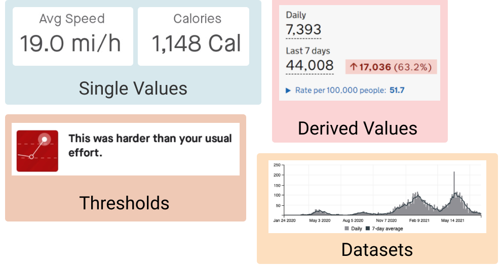
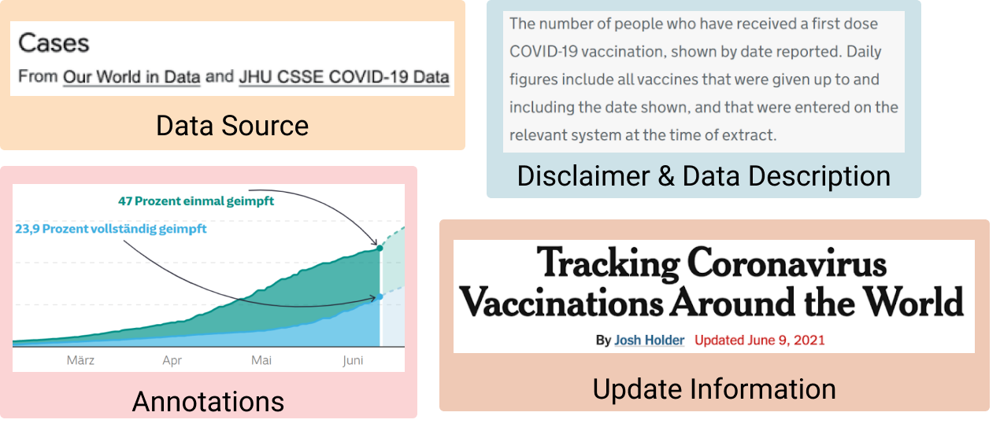

# 1. Component Design Patterns

The **components** of a dashboard are the crucial visual elements of a dashboard, relating to the data and its presentation. We identified four groups of design patterns: **data information**, **meta information**, the **visual encoding** of the data, and the high level **interactions** supported by the dashboard. We disregard any visual components that purely serve as decoration or embellishment, e.g., illustrative pictures, dividers, borders, etc.

## 1.1 Data Information

This group captures the type of information shown in a dashboard. We found that information in dashboards ranges from the presentation of *raw data* to several levels of *abstractions* which simplify and reduce the amount of information shown. In other words, given a data set with multiple data elements (e.g., rows in a data table) and attributes (columns), dashboards can provide many different abstractions of this data set. 

 **Single value(s)** are specific data points in a data set, e.g., the most recent value in a time series. Showing an individual value (compared to the entire or a filtered data set) implies the importance of the single, e.g., most recent, or highest, value in a given context. 

 **Datasets** offer a more complete presentation of data. This can include multiple data elements and attributes, time series, and detailed geographic information which all show raw data. In the case of time series, a dataset is often filtered to a time range of relevance, e.g., the *last 14 days*. Showing raw data implies lots of details but little "judgement" about which characteristics of this data set are important. Datasets are shown to provide an overview, support comparison of multiple data sets, and to encourage individual exploration and analysis. 
    
 **Derived value(s)** include statistics such as means, values, trends and change deltas. Derived values provide a higher-level of abstraction of a data set, since they imply a specific interest in these derived values. For example, derived values can be Key Performance Indicators in a given context. In many cases, derived values have been calculated independently from the dashboard (e.g., incidence values per fixed population).
    
 **Thresholds** make an explicit judgment about a data point, e.g., indicating whether a situation is *good*, *bad*, or *neutral*, according to objective thresholds for subjective labels. Thresholds are one of the highest levels of abstraction found in dashboards, as thresholds can have specific semantic meaning and implications.

### Data Information Examples

Examples of <strong>Data Information</strong> in dashboards.

## 1.2 Meta Information

This group captures additional information to provide context and explanation about the data. Sometimes this information is *implicitly* understood from the context the dashboard is used in, e.g., the current date can imply when data was last updated, or data released by a specific organization can indicate the source of the raw data.

 **Data source:** identifies where data comes from, potentially including links and explanations about how data were collected and analyzed, and which tools were used. May also provide direct access to the data (e.g., in embedded tables).

 **Disclaimer:** indicates specific assumptions and decisions in data processing and visualization, or gives context for data and how it is presented. For example, the EU COVID-19 variant dashboard outlines limitations in the data and explains why data may be missing/misleading, and Google's COVID-19 forecast for Japan explains where its predictions come from and what is/is not included in each statistic.

 **Data description:** gives a high-level description of the data to explain what the dashboard is showing.

 **Update information:** indicates when the data was last updated, typically specifying a date and/or time.

 **Annotations:** extra graphical embellishments added by the dashboard author to highlight specific points, changes, or developments in the data.

### Meta Information Examples

Examples of <strong>Meta Information</strong> in dashboards.

## 1.3 Visual Encoding

This group describes common solutions for presenting data information in dashboards. 

 **Numbers:** individual numbers placed prominently on a dashboard, mostly used to indicate single key values. Numbers can represent absolute values, proportions (e.g., percentage or normalized *per million*) and have specific units. Numbers are usually large in text size, compared to, e.g., titles and descriptions, to draw attention to their value. They are sometimes colored to attract attention.
    
 **Trend-arrows:** small arrows pointing up or down, used to indicate the direction of change in a data value. Some trend arrows are binary (up/down/neutral), whilst others include more fine-grained slopes. Trend arrows are often red or green, depending on semantics (positive/negative). These are often shown alongside *numbers* or included in *tables*. 
    
 **Pictograms:** abstract representations or symbols that illustrate concepts in the data. Can be used to represent data (i.e., conveying specific data information), or to designate the type of a data value found near the pictogram (but not conveying specific data information). 

 **Gauges and progress bar:** any sort of visualization used to represent a scale or range of a value. Specific solutions include semi-circular gauges, linear progress bars, thermometers, etc. Values represented by range-representations can refer to both values that only grow (e.g,. vaccination of population), as well as fluctuating values (e.g., COVID-19 cases per 1000 people). Some gauges come with an indication of 'critical' ranges, i.e,. a *threshold* indicating if values are positive/negative.
    
 **Signature Charts:** small and concise visualizations without axis descriptions, labels, or tickmarks. The idea is to give a quick understanding of a trend, akin to sparklines, rather than allowing the reading of precise values.

 **Visualizations:** detailed visualizations with sufficient details to read precise values (e.g., axes, ticks, values, etc).
    
 **Tables:** these show raw data values in a tabular format. The most simple form of a table is a simple key-value list, but tables can show several columns and may include *signature charts* and/or *trend-arrows*. Tables do not need to contain numerical values, but can also include information through color/darkness (e.g., heatmaps).

 **Text Lists:** lists of textual information, e.g.,like tickers that show non-quantitative information.

## 1.4 Interactions

This group describes common interaction approaches found within the dashboards. Interaction can exist through interactive data, user interface elements, and window-level interactions (e.g., scrolling). The patterns we highlight in this group refer to common roles that interaction could play in dashboard use, expressed through specific user interface components. These are defined broadly, to identify general usage patterns and how they can be implemented through dashboard designs.

 **Exploration** interactions allow users to explore data elements and the relations between them. Exploration interactions can take on my forms, including: *brushing and linking* interactions that link data representations across different views, *detail-on-demand* interactions that provide additional information through pop-ups or tooltips, and *search/filter* interactions that provide user interface elements to allow users to find or focus on specific data.

 **Navigation** interactions enable designers to direct users through facets of information in a particular order. Interaction elements can be used to navigate between different dashboard components and layout structures (e.g., pages, tabs). Interaction techniques and elements such as *scrolling*, *navigation buttons*, or *tab links* can be used to create a journey for the viewers through which they explore the information. Navigation can be *constrained* and follow a particular sequence, or can be *unconstrained* to allow free navigation. 

 **Personalization:** interactions allow users to redefine and reconfigure the information shown within a dashboard. For example, users may be able to add new representations (e.g., by choosing a new data feature to be visualized), resize dashboard elements, or reorder the existing dashboard elements. Such interactions may lead to more specialized and bespoke dashboard configurations, where the viewers are more actively engaged with the information content after the dashboard is designed and deployed.

# 2. Composition Design Patterns

The **composition** of a dashboard determines how its individual components are combined on screen. Dashboards show multiple information elements and their structure and layout on page are meaningful decisions made by a designer. We identified three groups of composition pattern: the **layout** of components in a dashboard, the **structure** of contents across one or more dashboard pages, and the use of **color** and color schemes throughout a dashboard.

## 2.1 Layout

Layout patterns describe how the widgets are laid out and sometimes implicitly grouped together in a dashboard - i.e., the prominent layout decision used to group a potentially large set of visual components. We emphasize that none of these layout patterns are exclusive and combinations can be used. Note: when describing layout patterns, we define a *widget* as the smallest unit on screen.

 **Open Layouts:** widgets of different sizes and aspect ratios are laid out in an open way without apparent specific rules. Often these widgets are aligned at a grid following classical design guidelines. There is no strong semantic associated with the location and adjacency of widgets and each widget seems to have equal importance. Widgets can be arranged closely if they are related (e.g., first and second COVID-19 vaccine dose) or they have similar visual types for aesthetics reason (e.g., top rows are all gauges and bottom rows are all line charts). Tiled layouts invite reordering and adjustment of widgets by the user.

 **Stratified Layouts:** these emphasize a top-down ordering of widgets and their information. For example, dashboards may show general high-level information along the top, while showing more detailed information further down. A strata layout can be used to emphasize some information (e.g., further up) over other information (e.g., further down).
    
 **Table Layouts:** these align widgets (or groups of widgets) into columns and rows, each with a specific semantic and inducing a repetition of information and visual encoding. Rows and columns can represent facets of the data set such as time, data elements, or any other grouping. Table layouts make it easy to retrieve and relate specific information in a multidimensional dataset. Usually, the visual content along a column uses the same visual encoding. Table layouts imply direct comparison and juxtaposition of information across widgets. 

 **Grouped Layouts:** these visibly group two or more widgets with a specific relation. For example, using diving lines, whitespace borders, or shaded background regions to emphasize grouping of related widgets. A dashboard with clear explicit grouping may help viewers observe the data more easily, especially for intended public audience.

 **Schematic Layouts:** these place widgets in a dashboard informed by some external property such as a physical layout or other types of schematic relationships (e.g., widgets placed on a map to represent geographic location of data points). Such dashboards can leverage a user's spatial/geographical/etc knowledge to support visual analytics tasks.

## 2.2 Structure

Whereas layout describes composition within an individual dashboard view, structure patterns describe how a dashboard organizes one or more of its views for presentation to the user. These patterns describe how dashboard content is shown on a single screen and which interactions, if necessary, are used to access additional information or views. While some consider it necessary for a dashboard to show content that fits on screen without the need for interaction, it may be necessary to deal with 'excess' content that overflows the available screen space. We consider structure as a deliberate design choice, not as a result of, e.g., responsive web layouts.

 **Flat** dashboards have a single view that should be fully visible on a given screen size. No interaction is needed to view all of the content, as all information fits on screen and is available at a glance.

 **Paginated** dashboards are composed of elements distributed across several pages, with one page shown on screen at a time; here, 'page' refers to a single composite view within a dashboard and does not necessarily mean, e.g., distinct web pages. There were many strategies for presenting an overview of available dashboard pages and allowing viewers to navigate between them, including:

-  **Tabs** structure dashboard views by category or theme. Through their titles, tabs inform the user about available content and supports navigation to the most relevant information.

-  **Links** provide dashboard navigation through visual elements (e.g., charts, titles, clickable text). We consider these separately from the link behaviors of tabs.

-  **Navigation buttons** allow users to move forwards or backwards through the pages of a dashboard in sequence. These may be used along with other navigation elements (e.g., tabs or links).

-  **Animated transitions** can be used to advance through dashboard pages automatically, like a slide show.

 **Overflow** designs allow a dashboard to exceed the available screen boundaries, so that additional content is revealed as the user scrolls. This offers an alternative to *Paginated* design, with all dashboard views available on a single page even if not all are visible at once.

 **Detail-on-demand** interactions allow dashboards to reduce the amount of information shown on screen at once, by revealing more details only when the user asks (for example, using tooltips or pop-ups).

 **Parameterized** dashboards allow users to control what content is currently shown. We found several approaches for providing dashboard parameters, including checkboxes, drop-down menus, lists and search fields for filtering data, sliders and pickers for selecting date ranges, or radio buttons and switches for changing the data. These typically allow users to choose which data is shown through the dashboard widgets. Parameterization can be used in combination with other structures, e.g., *Flat* or *Paginated* designs may offer search and filter capabilities.

## 2.3 Color

Color is an important visual variable in visualization and can be used for different purposes in dashboard design as well.

**Distinct** color schemes use unique colors (or colour palettes) for different widgets or data types.

**Shared** color schemes used a shared color palette across all dashboard components (e.g., re-using colours to conform with branding).

**Data Encoding** color schemes use colour to encode categories or scales within the data.

**Semantic** color schemes use color to indicate specific semantics about the data. This requires a mapping between data indicators and a real-life outcome with semantic connotations, e.g., traffic light schemes, green/red for positive/negative sentiment, etc.

**Emotive** color schemes can be a powerful means to add aesthetic strength and develop an emotive response in viewers.

### Color Examples

Examples of <strong>Color</strong> in dashboards.

