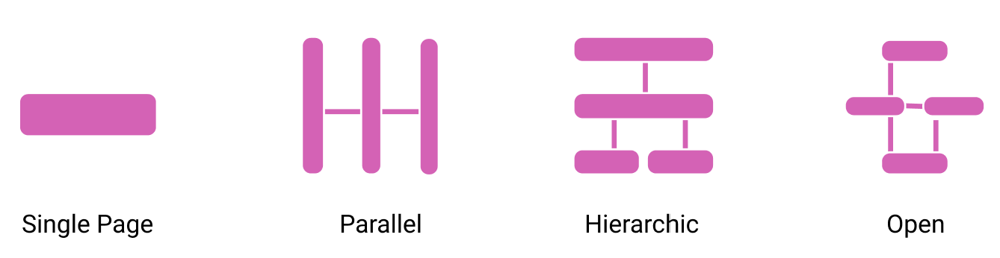

# Design Process and Guidelines

## High-level Design Guidelines

Guidelines are numberd for convenience but are **not ordered** by any particular priority.

1. Don’t overwhelm viewers
1. Avoid visual clutter
1. Avoid poor visual design 
1. Carefully chose KPIs
1. Align with existing workflows
1. Don’t add too much data
1. Provide for consistency
1. Provide for interaction affordances
1. Manage complexity
1. Organize charts symmetrically
1. Group charts by attribute
1. Order charts by time
1. Balance data + space 
1. Increase information
1. Avoid redundancy of information
1. Show information, rather than data
1. Design is an iterative process
1. Context is very important
1. State your meta data
1. Use color carefully
1. **Consider the dashboard templates** best suited to the dashboard
audience and their informational needs, and use their characteristic
design patterns as a checklist for design. 
1. Consider [design tradeoffs](tradeoffs.html)

## Design Tradedoffs

Dashboard design involves many tradeoffs, some of which are pictured in the schema below. Arrows are representative for relationships between the variables. A detailed schema and discussion on tradeoffs can be [found here](tradeoffs.html).

# Process Outline

Below is a possible outline for a design process. Stages should serve as a guide though the process, rather than strict instructions. Any design process is iterative, requires re-making decisions, exploring alternatives, and crticialy evaluating current solutions.

## Stage 0: Clarify the context

At this stage, you want to clarify the context in which your dashboard is being used in. This might require making decisions about some of these parameters. The more clearly you can articulate these decisions and parameters, the better you can make design decisions in your dashboard design process. 

* What is your **audience**? 
  * What do they know about your data and visualization? 
  * What do they know about the data? 
  * You can think of real people in your life that might use the dashboard. In design, that is called a [persona](https://www.interaction-design.org/literature/topics/personas).
* What is the **setting** in which they engage with the dashboard? 
  * Is this a computer screen? A mobile screen? A webite?  
  * Can they interaction? 
  * How much time do they have to view/interact with the dashboard? 
  * How frequently will they consult it? 
* What are the **tasks and decisions** your audience wants to perform?
  * what decisions do they want to make with the data? 
  * What information do they need?
  * Do they simply want to look up values? Do they want to compare? Do they want to analyze?   
* What **information** do they need to fulfill these tasks / make these decisions?
  * do they need to see all of the data? 
  * what data is most relevant?   

## Stage 1: Data & Information

**[Design Patterns & Examples](patterns.html#11-data-information)**

At this stage, you want to clarify which information from the dataset is important for the user in a given task (see Stage 0). The design patterns give you some ideas what information and how much information you want to provide about your data set. For some of these options we can say they are showing 'more' data, for others, we can say they abstract and show 'less' data.  

## Stage 2: Structure

**[Design Patterns & Examples](patterns.html#22-page-structure)**

At this stage, you should think about the overall structure of your information and whether you 
* can display everything a single page (or screen), or 
* whether you need multiple pages to show all the information you identified in stage 1.

A page / screen here refers to any consistent unit of information you are showing to the user at once. Information in your dashboard can be split across multiple pages.  If you have multiple pages, you want to think about their relationship and what information goes onto what page. A meaningful structure helps people navigating your dashboard (application). At the same time it helps you thinking about consistency across the individual design. For example, a parallel structure implies there is some visual consistency in the layout and information shown on each page. Vice versa, a hierarchical structure, e.g., implies there is more and more detail the further you drill down.

## Stage 3: Visual Representations

**[Design Patterns & Examples](patterns.html#13-visual-encoding)**

At this stage you want to find visual representations for your data and information (for each page). Similar to data, these visual representations can show more detail and using more screenspace, or they can be more concise and using less screenspace. You can match different design patterns about Data and Visual Representation.

**Specific guidelines**

1. Where space allows, **provide redundant and complementary views**
(visual encodings) and levels of abstraction (data information) for
your data:
  * e.g., show selected numbers alongside trend-arrows
and signature charts
  * e.g., more abstract encodings can occupy more screen space
to emphasize importance/relevance/etc
  * e.g., use single values , derived values and thresh-
olds to show key data points at a glance;
1. **Minimize repetitive data using abstraction** (to emphasize key data)
and parameterization (to support personalization );
1. Try to ensure a **consistent color scheme** across the entire dash-
board, either by reusing colors for the same data and value, or by
creating a dedicated and clearly distinguishable scheme for each
visualization.

## Stage 4: Layout

**[Design Patterns & Examples](patterns.html#23-layout)**

At this stage, you develop a layout of your page. You need to organize the individual components and visual representations into a meaningful structure. That structure should reflect how the components are related and of which importance they are to the user. For example, if you have lots of similar information (such as line charts for some data) you may consider a parallel (table) structure that emphsizes repetition and where each widget is containing similar information about its respective data. 

## Stage 5: Screen space

**[Design Patterns & Examples](patterns.html#21-screenspace)**

At this stage you need to decide how to deal with your screen space. You have several options to 
* try to fit everything into a single screen, or
* find ways to interactively show data you cannot fit onto a static screen. 

**Guidelines**

1. **Avoid overflow structure in analytic dashboards** to facilitate
comparison;
   * e.g., use flat or paginated dashboards that fit encod-
ings on screen;

## Stage 6: Interactivity 

**[Design Patterns & Examples](patterns.html#14 interactions)**

At this stage you will think about the specific interaction components you need to support
* exploration 
* focus & filter
* navitation
* personalization

1. Interaction can be a powerful means to personalize, explore, navigate, and focus. 
1. Minimize interaction: If you can solve something with minimal or no interaction, go for it.

