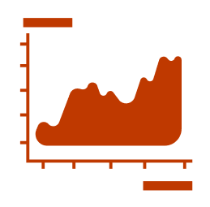
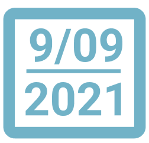

# Dashboard Types

Our analysis revealed several *dashboard types*, with shared characteristics, similar use of [design patterns](patterns.md), and similar goals. These demonstrate common ways of putting [design patterns](patterns.md) into practice. These dashboard types be used in design exploration and can inform discussion about the 'best' dashboard design for a given context.

## Static Dashboards

<!--  -->

-  **Flat** structure
-  **Signature Charts**
-  **Trend Arrows**
-  **Numbers**
-  **Open** layout

By static dashboard, we refer to the traditional notion of a dashboard as a *non-interactive* and *flat* structured display of information. These are less common now that one might imagine, which we attribute to the fact that modern dashboards are digital and it is easy to support interaction and drill-down tasks through more complex structures. Another reason might be that the range of display sizes on desktop computers, tablets, and mobiles encourages adaptive solutions (e.g., use of **overflow** or **paginated** structures).

## Analytic Dashboards

<!--  -->

-  **Visualizations**
-  **Tables**
-  **Exploration** interactions
-  **Navigation** interactions
-  **Personalization** interactions
-  **Parameterized** page structure
-  **Tabbed** page structure
-  **Linked** page structure
-  **Animated** page transitions

This dashboard type is what Stephen Few would call a *Faceted Analytic Display*. We see strong parallels to the concept of *Multiple Coordinates Views*. This type generally uses complete **visualizations** (rather than simpler **signature charts** and **trend arrows**). Many of the dashboard elements are fully interactive, providing for pan+zoom, focus+context, tooltips, brushing+linking and other **exploration** and **navigation** strategies. These dashboards can also provide **parameterization**, and use **tabs** or **linking** to switch between *multiple pages* of the dashboard. Importantly, these dashboards generally do not use *overflow* pagination, since scrolling makes it more difficult to compare visualizations.

## Magazine Dashboards

<!--  -->

-  **Visualizations**
-  **Tables**
-  **Table/Grid** layout
-  **Overflow** page structure

Many dashboards relating to Covid-19, climate change, politics, etc, are typically created by news agencies and similar media outlets. These dashboards are found as integral part of journalistic articles and resemble visualizations of the *magazine* genre. The text goes beyond basic meta information to provide additional commentary and storytelling about the data. These dashboards are often broken into several pages and have an **overflow** page structure with **linear layout**, with visualizations positioned at appropriate points in the text to tell a story about what the data shows.

As an example, The Economist Covid-19 tracker (shown below) provides viewers with a snapshot of Covid-19 cases and deaths across Europe, with tables, timeseries, trend lines and spike maps interleaved with narrative text. In addition to regular visualization updates, written content is also frequently updated as the 'story' changes, e.g., responding to emerging trends, the effects of vaccination, etc. These dashboards naturally require more effort to design and maintain; whilst visualizations may update automatically as the data changes, editorial oversight is necessary to ensure the story remains consistent with the changing data and its visual representation.

## Infographic Dashboards

<!--  -->

-  **Pictograms**
-  **Open** layout
-  **Overflow** page structure

Some dashboards have similar designs to infographics, including decorative graphical elements and other non-data ink shown alongside data representations. Similar to magazine dashboards, they use non-data media to annotate and embellish data. For example, the image below shows an infographic style dashboard that uses text, annotations and other embellishments to enhance data presentation and, in turn, help the data to convey a story.

Infographic dashboards are often used to represent static datasets; e.g., presenting snapshots of key data on a monthly or yearly basis. Often these infographics exceeded the vertical screen-space and could be explored through scrolling). The artistic content of infographic dashboards may require additional design time and chosen annotations and embellishments will be tailored to particular data points, so are less suited for dynamic dashboard use where data changes often. These dashboards may thus have a different intended use, with an audience expected to discover them over a longer period of time, rather than checking in frequently for updates.

## Repository Dashboards

<!--  -->

-  **Overflow** page structure
-  **Tabbed** page structures
-  **Data source**
-  **Data descriptions**
-  **Disclaimers**
-  **Update information**
-  **Visualizations**
-  **Numbers**
-  **Navigation** interactions

Many dashboards list a multitude of charts on a single website, with **overflow** page structures that make proper analytics difficult, i.e., making it more challenging to compare views. Their charts often lack textual or other narrative explanations, except for meta data information (which is often extensive). Charts may provide some interaction and usually provide links to *explore*, *filter*, and eventually *download* the raw data. Data and visualizations are updated, while choosing very common **visualizations** and **numbers** to visualize data. Extensive **meta information** is often provided for transparency and to support reuse. The images below show two examples of repository dashboard.

## Slideshow Dashboard

<!--  -->

-  **Animated** page transitions
-  **Visualizations**

Animated slideshow dashboards are uncommon, but merit discussion as a style. These dashboards use automated animations to move through its pages, rather than explicit user interaction. The drawback of timing the slideshow can be overcome through simple *navigation buttons*; however, taking away the ability to navigate compels users to look at and think about the data. We believe animated slideshow dashboards can be useful in public displays where interaction is not possible and to prompt reflection. The images below show three pages from an animated slideshow dashboard about climage change, where page transitions happen every 8 seconds.

&nbsp;&nbsp;

## Embedded Mini Dashboards

<!--  -->

-  **Flat** structure
-  **Parameterized** page structure
-  **Navigation** interactions

Dashboards can be embedded into other applications such as news websites. These concise *miniature* dashboards only occupy a small area on screen and usually come with a range of interactive features for navigation, or to parameterize the content. The image below shows two pages from a mini Covid-19 dashboard embedded into a news website; like similar mini dashboards, it uses *navigation* interactions to allow movement between pages and is *linked* to a more in-depth narrative dashboard that invites further exploration beyond the initial data at-a-glance.

